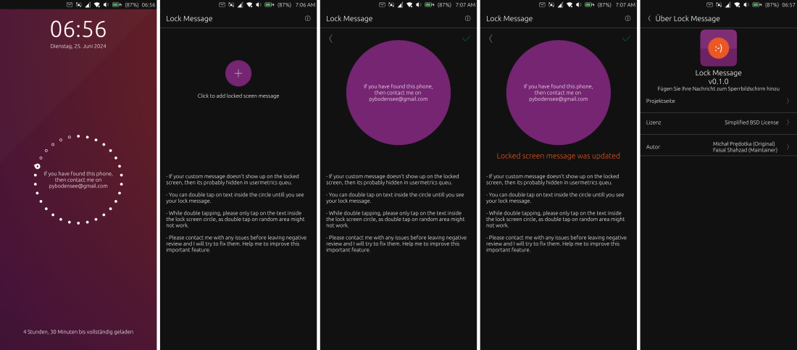

# Lock Message

<p dir="auto"><a href="https://open-store.io/app/lock-message.pybodensee"></a></p>

`Lock Message` is a fork of unmaintained `Circle Messsage` app on Ubunut Touch Open Store. `Lock Message` is an attempt to revive the app. 

This app will *Add your message to the lock screen*. You can add any message that can be useful to display on a locked screen. Here are some of the use-cases.

We have heavly edited the original version and modified GUI interface. See `git log` of the GitHub repository to get an idea of all the changes.

## How to Use?

Install the app from the App Store by following the download link. You will see a circular button with a `+` button in it. Click on it and then add your custom lock message. as shown in the images below. 

Then click on the green color tick button to add the text. Your custom lock message will be added to the lock screen.

Now check the lock screen of your Ubuntu Phone. You should see your custom lock message there. If you do not see it there, then there may be a display conflict with other user metrics.

To clear the other metrics, please restart your mobile phone to clear those metrics. After restart, you should see the custom message on the lock screen circle.

## Tests

**The current version is tested on Redmi Note 9 Pro and I am looking forward to feedback on other devices from fellow users.**

This app helps you write a message that will appear inside Circle on the lock screen. This feature can be useful as you can add custom messages to your UT lock screens.



## Trouble Shootings

**Question 1: Custom Lock Message is not showing  up on the lcok screen/circl?**

Answer: If your custom message doesn't show up on the locked screen, then please restart your Phone after removing the SIM card.

**Question 2: What happens if you restart Ubunut Touch without SIM Card?**

Answer: Restarting without SIM card will reset the usermetric sequences and Lock Message sequence will be shown afterwards.

**Question 3: Have you noticed unexpected behaviour?**

Please contact me with any issues before leaving negative review and I will try to fix them. Help me to improve this important feature.


## Use Cases

Some use cases where this can be useful.

- You can add a custom message with an Email address so that if you have lost your phone then someone who found that phone can reach you via Email.

- You can also leave a message with a second phone number so that someone found your phone can call you to share the location of your phone.

- You can add a custom message for someone who will have custody of your phone e.g. when you are leaving home or if you have temporarily changed the passcode for someone else to log in to your phone.

- ...

## License
This app is a fork of `Circle Message` created by Michał Prędotka and is available under BSD License. We have kept that old license intact. 

```
Copyright (C) 2024-   Faisal Shahzad
Copyright (C) 2017-2024  Michał Prędotka

Licensed under the BSD license. See LICENSE file for more details or drop us an email if you have any questions about this.
```